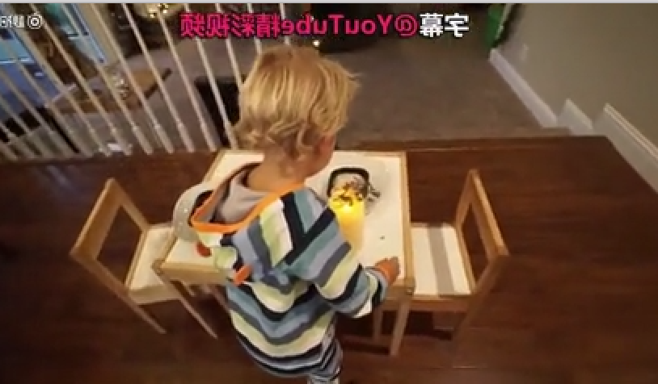
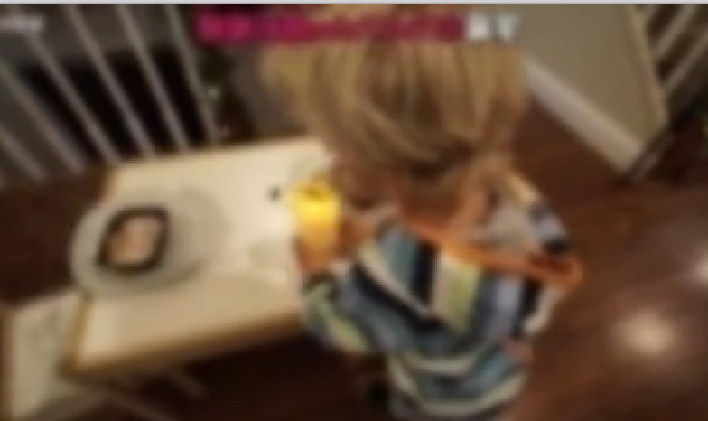

# 模糊，锐化和其他去噪

### boxblur参数解释

|描述| 使用均值模糊算法在输入上创建一个模糊效果|
|:-:|-|
|语法|boxblur=luma_r:luma_p[:chroma_r:chroma_p[:alpha_r:alpha_p]]filter expects 2 or 4 or 6 parameters, r =半径, p = 权重，程度，功率|
|********** |参数|
|alpha_r |-用于模糊相关输入平面(以像素为单位)的盒子的半径- value是下面描述的变量的表达式-默认值来源于luma_radius和luma_power|
|alpha_p |- alpha功率，确定过滤器被应用到相关平面的次数-默认值来源于luma_radius和luma_power|
|chroma_p |-色度功率，确定过滤器被应用到相关平面的次数-默认值来源于luma_radius和luma_power|
|chroma_p |-色度功率，确定过滤器被应用到相关平面的次数-默认值来源于luma_radius和luma_power|
|luma_p |- luma功率，确定过滤器被应用到相关平面的次数|
|***********	|在表达式中，对阿尔法，色度和luma半径的变量|
|w,h |输入宽度和像素高度|
|cw, ch	|输入色度图像的像素宽度和高度|
|hsub	|水平色度子样本值，为yuv422p像素格式为2|
|vsub|	垂直色度子样本值，为yuv422p像素格式为1|
||半径是一个非负数，并且不能大于luma和阿尔法平面的表达式min(w,h

例子, 譬如luma半径为1.5，luma功率为1
```
ffmpeg -i input.mpg -vf boxblur=1.5:1 output.mp4
```




### smartblur参数解释

|描述| 模糊输入而不影响轮廓|
|:-:|-|
|语法 |smartblur=luma_r:luma_s:luma_t[:chroma_r:chroma_s:chroma_t]parameters in [] are optional, r = radius, p = power, t = threshold|
|*********** |参数的描述|
|chroma_r |色度(颜色)半径，从0.1到5.0的浮点数，它指定用于模糊图像的高斯滤波器的方差(如果更大)|
|chroma_s |色度强度，在范围-1.0到1.0之间的浮点数，配置模糊;从0.0到1.0的值将模糊图像，从-1.0到0.0的值将增强图像|
|chroma_t |chrominance treshold，一个从-30到30的整数，它被用作一个系数来决定一个像素是否应该被模糊;0的值将过滤所有的图像，0到30的值将过滤平坦区域，从-30到0的值将过滤边缘|
|luma_r |亮度(亮度)半径，从0.1到5.0的浮点数，指定用于模糊图像的高斯滤波器的方差(如果更大的话，会更慢)|
|luma_s |亮度强度，从-1.0到1.0的浮动数值，配置模糊;从0.0到1.0的值将模糊图像，从-1.0到0.0的值将增强图像|
|luma_t |亮度treshold，一个整数，范围从-30到30，作为一个系数来决定一个像素是否应该被模糊;0的值将过滤所有图像，0到30的值将过滤平面区域，从-30到0的值将过滤edgese图像|
| |如果色度参数没有设置，则使用luma参数来实现像素的色度|

例如，为了改进半色调图像，我们将luma半径设为最大值5，光照强度为0.8，亮度阈值为0，因此图像是模糊的
```
ffmpeg -i input -vf smartblur=5:0.8:0 output
```

### 锐化视频unsharp


|描述 |根据指定的参数增加或模糊输入视频|
|:-:|-|
|语法 |l_msize_x:l_msize_y:l_amount:c_msize_x:c_msize_y:c_amountall parameters are optional, if not set, the default is 5:5:1.0:5:5:0.0|
|*********** |参数的描述|
|l_msize_x,luma_msize_x |luma矩阵水平尺寸，3和13之间的整数，默认值为5|
|l_msize_y,luma_msize_y |luma矩阵的垂直大小，整数在3和13之间，默认值是5|
|l_amount,luma_amount |luma效应强度，介于-2.0和5.0之间的浮点数，负值创建模糊效果，默认值为1|
|c_msize_x,chroma_msize_x |色度矩阵的水平大小，整数在3和13之间，默认值是5|
|c_msize_y,chroma_msize_y |色度矩阵的垂直大小，整数在3和13之间，默认值为5|
|c_amount,chroma_amount |chroma效果强度，-2.0和5.0之间的浮动值，负值创建模糊效果，默认值为0.0|

锐化滤波器可以作为普通的不锐化掩模和高斯模糊，如：输出将使用尺寸为5*5的高亮矩阵和亮度效果强度为1.0的锐化，为了产生高斯模糊效果，例如，我们可以使用
负数来表示亮度和/或色度值

```
ffmpeg -i input -vf unsharp=5:5:-2
```